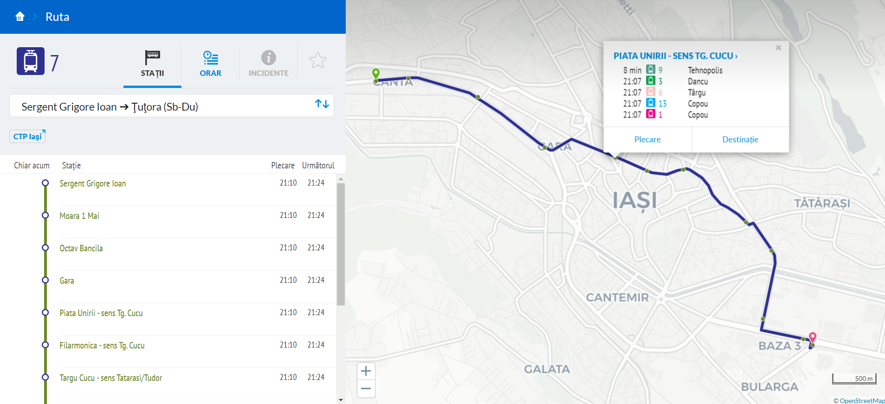

# Iasi-GTFS-Exporter
Export GTFS files for Iași public transit

~~Currently this only works for routes, shapes and stops. In the future we will try to add trips and stop-times/frequencies, but the data presented on the website is kindof irregular unfortunately.~~ It works for trips, stop times and frequencies also now, but it is still buggy. **SCTP Iași** does not publish the time it takes to get from one stop to another, so we query an OSM PBF map file using OSRM backend and profiles in order to calculate the times from the shapes and stop locations. You will need an up to date OSM file of Romania and a custom tram profile.

```
git clone https://github.com/FlashWebIT/Iasi-GTFS-Exporter.git
cd Iasi-GTFS-Exporter
mkdir data
cd data
wget https://download.geofabrik.de/europe/romania-latest.osm.pbf
mv romania-latest.osm.pbf bus.osm.pbf
../node_modules/osrm/lib/binding/osrm-extract -p ../node_modules/osrm/profiles/car.lua bus.osm.pbf
../node_modules/osrm/lib/binding/osrm-contract bus.osrm
mv bus.osm.pbf tram.osm.pbf
wget https://github.com/Project-OSRM/osrm-backend/files/3016554/Tram.txt -O ../node_modules/osrm/profiles/tram.lua
../node_modules/osrm/lib/binding/osrm-extract -p ../node_modules/osrm/profiles/tram.lua tram.osm.pbf
../node_modules/osrm/lib/binding/osrm-contract tram.osrm
cd ..
node index.js
```

Here's how it looks in Digitransit:


This is still buggy, see the validation [here](https://flashwebit.github.io/Iasi-GTFS-Exporter/validation-results.html). We appreciate any help and input, as this is pro-bono work.

Also, a request was made to the operator to provide data in a processable format but it is yet to be addressed.
